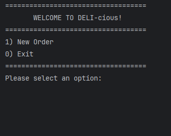

# DELI-cious Ordering System

## Table of Contents
- [Project Overview](#project-overview)
- [Features](#features)
- [Application Screens](#application-screens)
- [Interesting Code Snippet](#interesting-code-snippet)
- [Diagrams](#diagrams)
- [Future Enhancements](#future-enhancements)

---

### Project Overview

The **DELI-cious Ordering System** is a console-based application designed for a deli-style restaurant, allowing users to create and customize orders with sandwiches, drinks, chips, and signature sandwiches. The system provides a smooth ordering experience with intuitive navigation to add items, list the current order, and checkout.

### Features

- **Customizable Orders**: Users can add sandwiches with customizable sizes, breads, and toppings.
- **Signature Sandwiches**: Predefined sandwiches (e.g., BLT, Philly Cheese Steak) with options to add or remove toppings.
- **Drinks and Chips**: Select from various sizes for drinks and flavors for chips.
- **Order Summary and Checkout**: View the current order, calculate totals, and finalize with a thank-you message.

### Application Screens

Below are screenshots of the different screens available in the DELI-cious application:

1. **Main Menu Screen**  
   

2. **Add Sandwich Screen**  
   

3. **Add Drink Screen**  
   

4. **Add Chips Screen**  
   

5. **Add Signature Sandwich Screen**  
   

6. **Order Summary Screen**  
   

7. **Checkout and Thank You Screen**  
   

### Interesting Code Snippet

One of the interesting code implementations is the use of **text blocks** and reusable **DisplayUtils** for rendering ASCII-style headers and menus, which keeps the console application visually structured and easy to navigate. This approach enhances readability and maintains a consistent layout across different screens.

Here’s an example of a text block used for the **Main Menu Header**:

```java
public static final String MAIN_MENU_HEADER = """
    ===================================
           WELCOME TO DELI-cious!
    ===================================
    1) New Order
    0) Exit
    ===================================
    """;
```

And here's how it's used within the UserInterface class:
```java
DisplayUtils.printTextBlock(DisplayUtils.MAIN_MENU_HEADER);
System.out.print("Please select an option: ");
int choice = scanner.nextInt();
scanner.nextLine();
```
### Diagrams

Below are diagrams illustrating the structure and flow of the **DELI-cious Ordering System**:

#### Class Diagram
The **Class Diagram** shows the relationships between key classes, including:

- **UserInterface**: Manages the flow of the application.
- **Order**: Manages items in the order such as sandwiches, drinks, and chips.
- **DisplayUtils**: Utility for displaying headers and text blocks in the console.
- **Screen Classes**: Classes like `AddSandwichScreen`, `AddDrinkScreen`, `AddChipsScreen`, and `SignatureSandwichScreen` handle user interactions for each item.


#### Flow Diagram
The **Flow Diagram** outlines the user journey from the **Main Menu** to ordering customization and checkout.

- **Main Menu**: Options to create a new order or exit.
- **New Order**: Allows adding sandwiches, drinks, chips, or signature sandwiches, listing the current order, or checking out.
- **Checkout**: Displays an order summary and total, then ends with a thank-you message.


### Future Enhancements

Potential improvements for this application include:

- **Graphical User Interface (GUI)**: Transitioning from a console-based application to a graphical interface.
- **Order Persistence**: Adding a database or file storage to save order history or user preferences.
- **Extended Menu Options**: More variety in sandwiches, drinks, and chips, including international flavors.
- **Discounts and Loyalty Points**: Adding support for discounts or a loyalty program to enhance user engagement.

